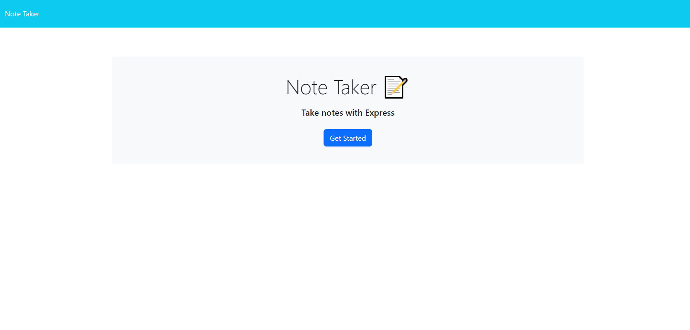
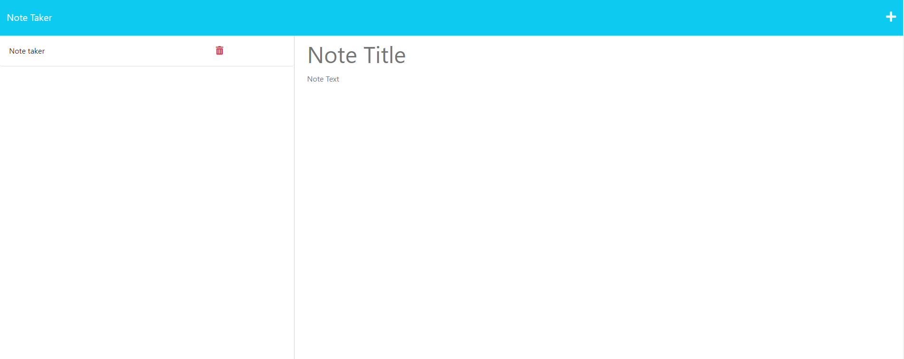

# Note-Taker

## Description
This application creates a server base note taker. The data can be saved in the server (back end) other than the local storage (front end). From this application backend server.js is created for communication and response to the client request.

## Installation
express is used create server.

fs is used to read and write file.

uuid is used to create random id for 'delete' request.

## Feature
Create note by entering title and the note text.
Click save icon to save the note in the server database.
The note will be presented at the right hand side of the page with a delete icon.
Click the delete can remove the note from the server and the list

# Mock-up

# Applicaiton link: https://boiling-mesa-85577.herokuapp.com/
# Github repository: https://github.com/houchenghao/Note-Taker